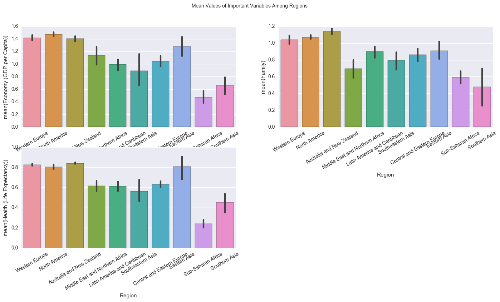

# Data Analysis of World Happiness Report 2015 & 2016

## Dataset Description
- The World Happiness Report is a landmark survey of the state of global happiness. The first report was published in 2012, the second in 2013, and the third in 2015. The World Happiness Report 2016 Update, which ranks 156 countries by their happiness levels, was released in Rome in advance of UN World Happiness Day, March 20th. The reports review the state of happiness in the world today and show how the new science of happiness explains personal and national variations in happiness. They reflect a new worldwide demand for more attention to happiness as a criteria for government policy.
- Resource: https://www.kaggle.com/unsdsn/world-happiness
- Dataset Preview

| Country     | Region         | Happiness Rank | Happiness Score | Lower Confidence Interval | Upper Confidence Interval | Economy (GDP per Capita) | Family  | Health (Life Expectancy) | Freedom | Trust (Government Corruption) | Generosity | Dystopia Residual |
|-------------|----------------|----------------|-----------------|---------------------------|---------------------------|--------------------------|---------|--------------------------|---------|-------------------------------|------------|-------------------|
| Denmark     | Western Europe | 1              | 7.526           | 7.46                      | 7.592                     | 1.44178                  | 1.16374 | 0.79504                  | 0.57941 | 0.44453                       | 0.36171    | 2.73939           |
| Switzerland | Western Europe | 2              | 7.509           | 7.428                     | 7.59                      | 1.52733                  | 1.14524 | 0.86303                  | 0.58557 | 0.41203                       | 0.28083    | 2.69463           |
| Iceland     | Western Europe | 3              | 7.501           | 7.333                     | 7.669                     | 1.42666                  | 1.18326 | 0.86733                  | 0.56624 | 0.14975                       | 0.47678    | 2.83137           |

## Analysis 1
- Goal: Compare regional distributions of countries in World Happiness Reports of 2015 and 2016
- Method: Add 'Year' variable to 2 datasets and concatenate them in pandas; use seaborn.violinplot
- Result:  
__1. most regions remain the same__  
__2. More countries in Central and Eastern Europe falls between 5-6 in 2016__  
__3. More countries in Sub-Saharan falls around 4 in 2016__  
  

## Analysis 2
- Goal: Rank change of each country in Wordl Happiness Reports of 2015 and 2016
- Method: Calculate the difference between the columns of "Happiness Rank_2015" and "Happiness Rank_2016"; sort rows by the value of rank change; define a function to extract 'Region' from two dataframes; use seaborn.swarmplot
- Result:  

__1. Algeria has the highest rank increase__  

| Country | Happiness Rank_2015 | Happiness Rank_2016 | Region                          | Rank Change |
|---------|---------------------|---------------------|---------------------------------|-------------|
| Algeria | 68                  | 38                  | Middle East and Northern Africa | -30         |

__2. Liberia has the highest rank decrease__  

| Country | Happiness Rank_2015 | Happiness Rank_2016 | Region             | Rank Change |
|---------|---------------------|---------------------|--------------------|-------------|
| Liberia | 116                 | 150                 | Sub-Saharan Africa | 34          |

__3. New countries on 2016 list__  

| Country           | Region_2016                 | Happiness Rank_2016 |
|-------------------|-----------------------------|---------------------|
| Puerto Rico       | Latin America and Caribbean | 15.0                |
| Belize            | Latin America and Caribbean | 52.0                |
| Somalia           | Sub-Saharan Africa          | 76.0                |
| Somaliland Region | Sub-Saharan Africa          | 97.0                |
| Namibia           | Sub-Saharan Africa          | 113.0               |
| South Sudan       | Sub-Saharan Africa          | 143.0               |

__4. Countries off 2016 list; Note Oman ranks 22 in 2015, however it is off the list of 2016__  

| Country                  | Region_2015                     | Happiness Rank_2015 |
|--------------------------|---------------------------------|---------------------|
| Oman                     | Middle East and Northern Africa | 22.0                |
| Somaliland region        | Sub-Saharan Africa              | 91.0                |
| Mozambique               | Sub-Saharan Africa              | 94.0                |
| Lesotho                  | Sub-Saharan Africa              | 97.0                |
| Swaziland                | Sub-Saharan Africa              | 101.0               |
| Djibouti                 | Sub-Saharan Africa              | 126.0               |
| Central African Republic | Sub-Saharan Africa              | 148.0               |

__5. Most countries remain the same, while countries in Sub-Suharan Africa have more changes__   
  

## Analysis 3
- Goal: Calculate the mean value of each variable
- Method: use mean/min/max functions on dataframes and calculate mean difference between 2 years; plot by bar chart
- Result:  

__1. The variable of Family decreases the most in 2016 by 20%__   

|                               | mean_2015           | mean_2016           | difference(%) |
|-------------------------------|---------------------|---------------------|---------------|
| Economy (GDP per Capita)      | 0.8461372151898726  | 0.9538798089171973  | 12.7          |
| Family                        | 0.9910459493670887  | 0.7936210828025482  | -19.9         |
| Health (Life Expectancy)      | 0.6302593670886079  | 0.5576189808917195  | -11.5         |
| Freedom                       | 0.4286149367088611  | 0.3709938853503184  | -13.4         |
| Trust (Government Corruption) | 0.14342183544303794 | 0.1376237579617835  | -4.0          |
| Generosity                    | 0.23729550632911403 | 0.24263490445859875 | 2.3           |
| Dystopia Residual             | 2.098976772151899   | 2.3258065605095544  | 10.8          |

__2. Compare the mean values of each variable between 2015 and 2016__  
  

## Analysis 4
- Goal: Variable Correlation
- Method: use corr function of pandas on dataframes; plot heatmap and the corresponding correlations between every two variables
- Result:

__1. Economy, Family and Health are the three most important factors to Happiness Score; health and economy are highly correlated__  
  

## Analysis 5
- Goal: Compare mean values of important variables - Economy, Family and Health - among regions
- Method: use bar chart to plot the mean values of regions for different variables
- Result:  

__1. While East Asia is not at the leading position in the graphs of Economy and Family, it has relatively high Health mean value__   
__2. Latin America and Carribean has high Family mean value though it is in the middle for Economy variable__  
 
