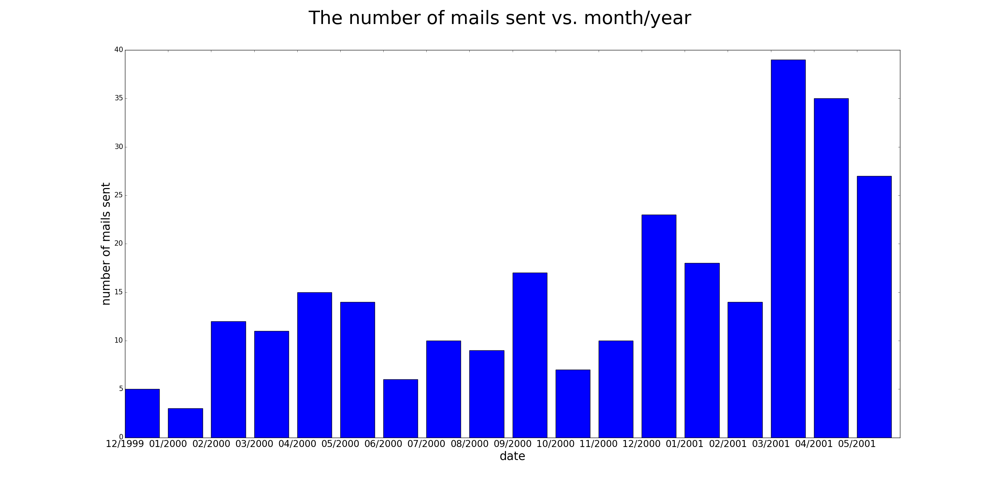

# Report
## Question 1
### Analysis 1
- Goal: analyze the trend of mails sent by Jeff Skilling, the former CEO of the Enron Corporation, between 1999 to 2001
- Dataset: Enron's email dataset - Jeff Skilling's sent mails
- Method: parse "date" from each sent mail; calculate the number of mails sent in each month from 1999 to 2001
- Result: 

### Analysis 2
- Goal: Analyze the network of Jeff Skilling by calculating the number of mails he sent to each contacts
- Dataset: Enron's email dataset - Jeff Skilling's sent mails
- Method: parse "to" from each sent mail; calculate the number of mails sent to each recipient(internal/external) by Jeff Skilling
- Result:

#### External recipients
|                              |                 | 
|------------------------------|-----------------| 
| recipient                    | number of mails | 
| kskilling@ehshouston.org     | 10              | 
| markskilling@hotmail.com     | 8               | 
| kcompton@kpcb.com            | 7               | 
| stanmarek@marekbros.com      | 6               | 
| eharris@insightpartners.com  | 5               | 
| mike_buttrey@mhbt.com        | 4               | 
| johnt@austinventures.com     | 4               | 
| fredinvt@juno.com            | 4               | 
| annb@redstonegrp.com         | 3               | 
| nkelley@tqcap.com            | 3               | 
| dottie@kerr-solutions.com    | 3               | 
| chuck.paul@a-closer-look.com | 3               | 
| gkoutani@aol.com             | 3               | 
| johnathan_dazey@gensler.com  | 2               | 
| gwhipple@us.ibm.com          | 2               | 
| knethercutt@houstontech.org  | 2               | 
| monica.mack@chase.com        | 2               | 
| holfati@ispheres.com         | 2               | 
| bbrannen@angus-group.com     | 2               | 
| dchristo2@attglobal.net      | 2               | 
| darnoff@greylock.com         | 2               | 

#### Internal recipients
|                             |                 | 
|-----------------------------|-----------------| 
| recipient                   | number of mails | 
| amelia.alder@enron.com      | 8               | 
| sherri.sera@enron.com       | 7               | 
| matthew.scrimshaw@enron.com | 6               | 
| kevin.hannon@enron.com      | 6               | 
| david.delainey@enron.com    | 5               | 
| john.sherriff@enron.com     | 4               | 
| jay.fitzgerald@enron.com    | 4               | 
| steven.kean@enron.com       | 4               | 
| cliff.baxter@enron.com      | 3               | 
| wade.cline@enron.com        | 3               | 
| louise.kitchen@enron.com    | 3               | 
| rod.hayslett@enron.com      | 3               | 
| mark.muller@enron.com       | 3               | 
| greg.whalley@enron.com      | 3               | 
| ben.glisan@enron.com        | 3               | 
| dorothy.dalton@enron.com    | 3               | 
| isc.hotline@enron.com       | 2               | 
| billy.dorsey@enron.com      | 2               | 
| karen.marshall@enron.com    | 2               | 
| rick.buy@enron.com          | 2               | 

